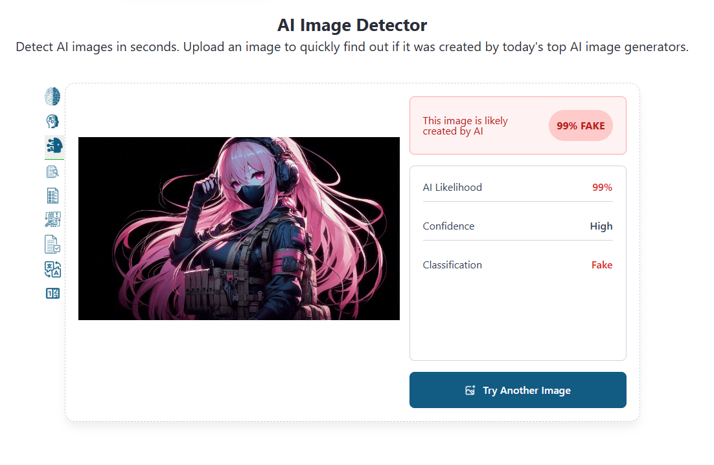
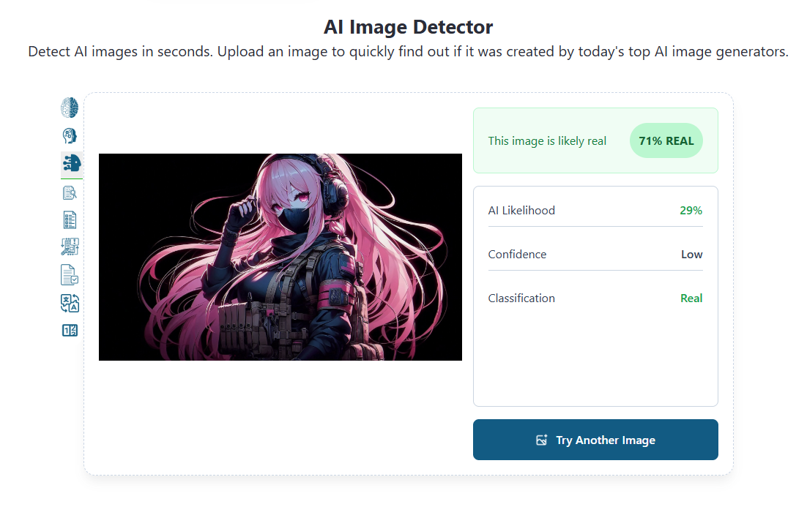

# SpectrePass

Make AI-generated images read as **real** to AI image detectors — without visible quality loss.

A lightweight offline tool that applies a chain of image-safe transforms (micro-shift, film grain, edge-preserving filtering, recompression, denoise, metadata strip) to disrupt the statistical fingerprints AI detectors look for, while keeping the picture visually identical.

## Result Example

Same image, tested on an AI Image Detector:

**Before scrubbing — flagged as AI:**



> AI Likelihood: **99%** · Confidence: High · Classification: **Fake**

**After scrubbing — passes as real:**



> AI Likelihood: **29%** · Confidence: Low · Classification: **Real** (71% REAL)

## Features

- Single-file Windows app — no install, no internet, runs fully offline
- Batch processing (files and folders)
- Adjustable JPEG quality (70–100, default 92)
- Preserves resolution and visual quality
- Strips EXIF / embedded metadata
- Supports JPG, JPEG, PNG, BMP, WEBP, TIFF

## How It Works

`process_image()` in `source code/scrubber.py` runs this pipeline:

1. **Color channel micro-shift** — sub-pixel shift (±2px) breaks pixel-grid artifacts
2. **Light Gaussian noise** (σ ≈ 2.3) — perturbs synthetic smoothness
3. **Luminance-dependent film grain** — mimics natural sensor noise
4. **Bilateral filter** (edge-preserving) — smooths flat AI gradients, keeps edges
5. **Gentle unsharp mask** — restores natural micro-contrast
6. **JPEG recompress (q85) + reload** — breaks frequency-domain signatures
7. **Light denoise** (`fastNlMeansDenoisingColored`) — removes harsh synthetic texture
8. **Metadata strip** — rebuilds pixels via Pillow so no EXIF / generator tags remain
9. Dimensions are restored exactly — no resize, no crop.

## Download & Run

1. Download `SpectrePass.exe` from Releases.
2. Double-click to run (Windows 10/11, no Python needed).
3. **Add Images** or **Add Folder** → pick output folder → set quality → **SCRUB IMAGES**.
4. Scrubbed files are saved as `<name>_scrubbed.<ext>` in the output folder.

## Run From Source

```bash
pip install opencv-python numpy Pillow
python "source code/scrubber.py" input.jpg output.jpg
```

Or launch the desktop UI:

```bash
pip install opencv-python numpy Pillow
python scrubber_ui.py   # (full UI source — ask maintainer, or build below)
```

`process_image(input_path, output_path, quality=92)` can also be imported and used as a library.

## Build the .exe Yourself

```bash
pip install pyinstaller opencv-python numpy Pillow
pyinstaller --noconfirm --onefile --windowed --name SpectrePass scrubber_ui.py
# output: dist/SpectrePass.exe
```

## Project Structure

```
.
├── Example2.png           # before: detected 99% FAKE
├── Example.png            # after: detected 71% REAL
├── README.md
└── source code/
    └── scrubber.py        # core pipeline (process_image)
    └── scrubber_ui.py     # UI Version
```

## Notes & Disclaimer

- No bypass is guaranteed — detectors update constantly. This tool lowers detection scores; it does not promise 0%.
- Intended for privacy, artistic, and research use (e.g. cleaning metadata fingerprints from your own AI-assisted artwork). Don't use it to deceive, defame, or violate any platform's terms.
- Output quality depends on input — photographic/illustrated images hold up best; heavy text or fine line-art may soften slightly at low quality settings.
